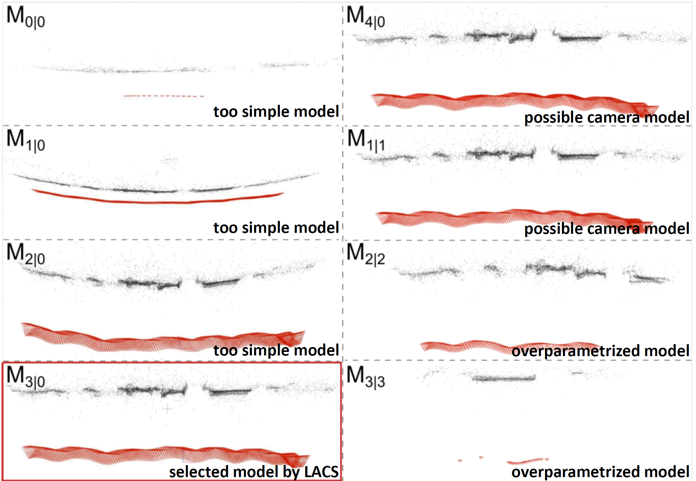
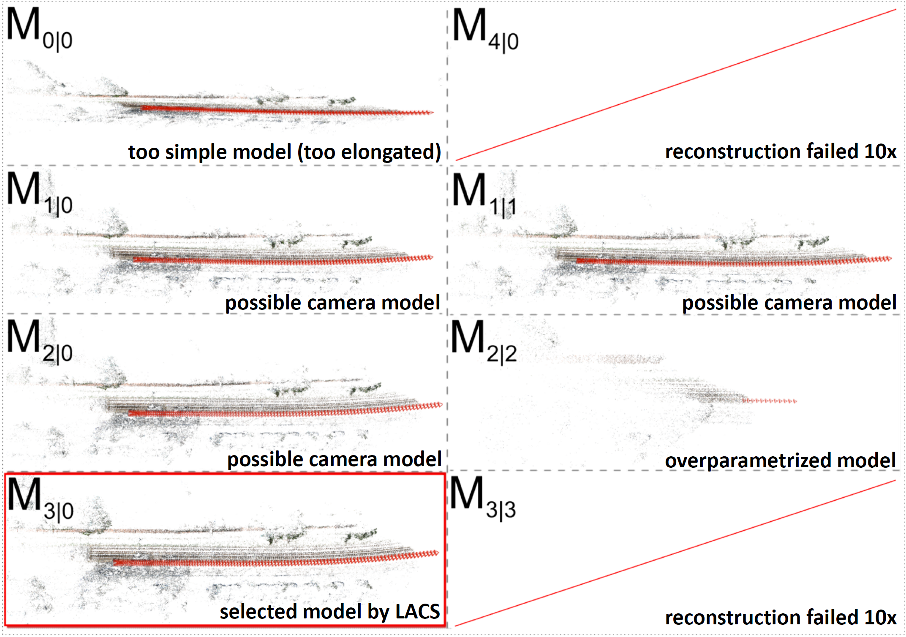

<iframe id="intro_movie" width="256" height="144" src="https://www.youtube.com/embed/grPFAf0Ul3g" frameborder="0" allow="accelerometer; autoplay; encrypted-media; gyroscope; picture-in-picture" allowfullscreen></iframe>

This is a project page dedicated to our CVPR 2020 paper.  

For more information see <a href="http://openaccess.thecvf.com/content_CVPR_2020/html/Polic_Uncertainty_Based_Camera_Model_Selection_CVPR_2020_paper.html">the paper</a> and <a href="http://147.32.71.15">DEMO WEBSITE</a>  

# Motivation
SfM pipelines require many configuration parameters that are hard to set in practice. A crucial parameter to set is the camera model to be used. In fact, every geometrical solver is derived for one particular camera model, and the non-existence of an automatic method for model selection forces the user to choose it manually.
  
* Using an overlay simple camera model may lead to under-fitting and inaccurate reconstruction.
* Using too complex models may lead to over-fitting the data and result in degeneracies.  
* The ultimate goal of a camera model selection method is to select a "good" model where (i) all images are registered, (ii) the reprojection error is minimal, and (iii) the number of parameters is small. This goal is very hard to reach in practice.

# Contribution
We present an extensive comparison of standard, robust, and geometrical information criteria on the important task of radial distortion model selection. Motivated by the bad performance of the existing criteria we present a new way to
* Significantly increase in the reconstruction quality as well as a speedup of the reconstruction process by automatic camera model selection
* Evaluate the quality of the scene by Accuracy-based Criterion (AC)
* Propose a model Selection method (ACS) and fine-tuned learned LACS method for radial distortion model selection

## The idea
The idea is to create a unique quality measurement for 3D reconstructions from images. We propose to use the accuracy of calculated parameters (AC), i.e., the accuracy of camera poses and the positions of points in 3D, as the scene quality measurement. The quality measure will provide an order of suitability of camera models and select the best one, i.e., the camera model leading to the most accurate reconstruction.

We can propagate the accuracy of 2D observations in images into the 3D scene, see <a href="https://michalpolic.github.io/usfm.github.io">USfM framework</a> for details. 

To compare the suitability of several camera models, we need to calculate a small (e.g., 15 images) sub-reconstructions from a subset of images and propagate the accuracy of observations into 3D scenes. 

The ability to compare covariance matrices for different reconstructions is achieved by (i) aligning coordinate systems of sub-reconstructions before uncertainty propagation and (ii) fixing the gauge of the covariance matrix using suitable S-transformation. 

Please see our <a href="http://openaccess.thecvf.com/content_CVPR_2020/html/Polic_Uncertainty_Based_Camera_Model_Selection_CVPR_2020_paper.html">paper</a> for more details.

## Examples

The "good" camera model for real data is rarely known, and therefore we evaluated the correctness of these methods on a large amount of various synthetic scenes. The following success rate of correctly estimated camera model was evaluated from 72000 synthetic datasets simulating real cameras and 3D scenes, for different camera models, outlier, and noise contamination. Our methods ACS and LACS significantly outperform SOTA approaches. 

  

The real experiments can be evaluated by yourself on <a href="http://147.32.71.15">DEMO WEBPAGE</a>. We provide here two examples of selected camera models for wide known datasets, <a href="https://www.eth3d.net">ETH3D dataset</a> and <a href="http://www.cvlibs.net/datasets/kitti">KITTI dataset</a>.

  

  

## License
The codes are realeased under <a href="https://en.wikipedia.org/wiki/MIT_License">MIT licence</a>.

