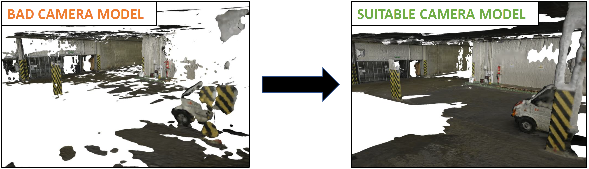
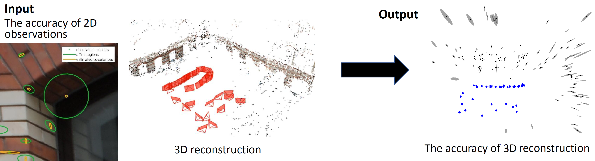
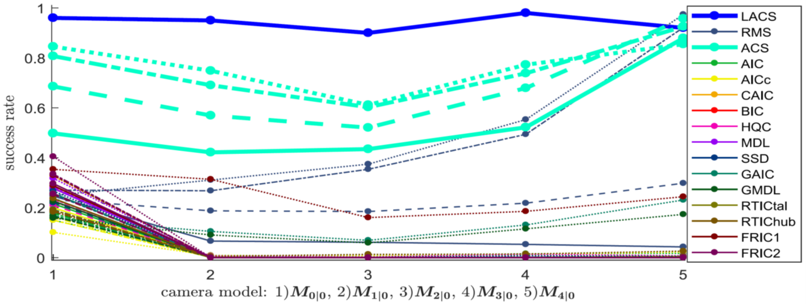
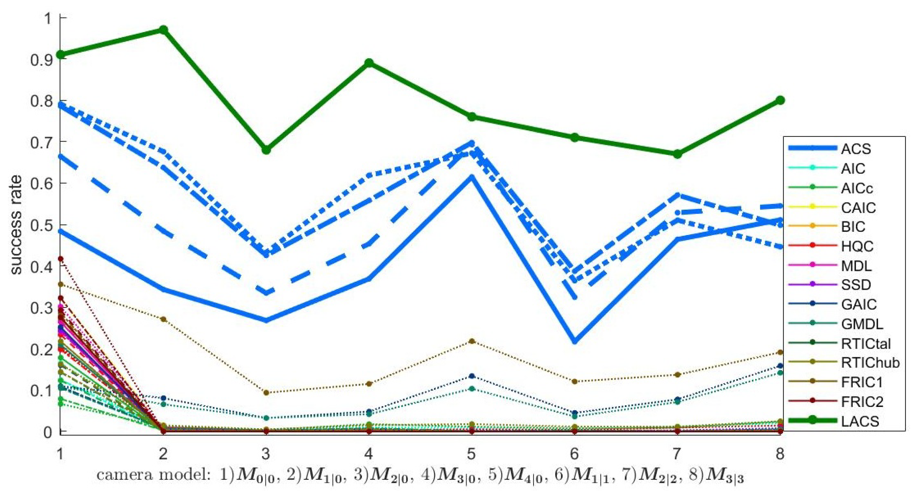

<iframe width="1024" height="576" src="https://www.youtube.com/embed/grPFAf0Ul3g" frameborder="0" allow="accelerometer; autoplay; encrypted-media; gyroscope; picture-in-picture" allowfullscreen></iframe>

This is a project page dedicated to our CVPR 2020 paper.  

For more information see <a href="http://openaccess.thecvf.com/content_CVPR_2020/html/Polic_Uncertainty_Based_Camera_Model_Selection_CVPR_2020_paper.html">the paper</a> and <a href="http://147.32.71.15">our demo website</a>  

# Motivation
SfM pipelines use many configuration parameters that are hard to set in practice. A crucial parameter to set is the camera model to be used. In fact, every geometrical solver is derived for one particular camera model and the nonextistence of automatic metod for model selection force the user to choose it manualy.
  
* Using a too simple camera model may lead to under-fitting and inaccurate reconstruction.
* Using too complex model may lead to over-fitting the data and result in degeneracies.  
* The ultimate goal of a camera model selection method is to select a ”good” model where (i) all images are registered, (ii) the reprojection error is minimal, and (iii) the number of parameters is small. This goal is very hard to reach in practice.

# Contribution
We present extensive comparison of standard, robust, and geometrical information criteria on the importatnt task of radial distortion model selection. Motivated by bad results we present a new way to
* Significantly increase in the reconstruction quality as well as speedup of the reconstruction process by automatic camera model selection
* Evaluate the quality of the scene by Accuracy-based Criterion (AC)
* Propose model Selection method (ACS) and fine tuned learned LACS method for radial distortion model selection

## The idea
The idea is to create unique quality measurement for the reconstructions form images. We propose to use the accuracy of calculated parameters (AC), i.e., the accuracy of camera poses and the positions of points in 3D, as such scene quality measurement. The quality measurement will provide an order of suitability of camera models and select the best one, i.e., the camera model leading to the most accurate reconstruction.

We can propagate the accuracy of 2D observations in images into the 3D scene, see <a href="https://michalpolic.github.io/usfm.github.io">USfM framework</a> for details. 

To compare the suitability of several camera models, we need to calculate a small sub-reconstructions from a subset of images and propagate the accuracy of observations into 3D scenes. 

The comparable covariance matrices are achieved by (i) aligning coordinate systems of sub-reconstructions before uncertaitny propagation and (ii) fixing the gauge of covariance matrix using suitable S-transoformation. 

Please see our <a href="http://openaccess.thecvf.com/content_CVPR_2020/html/Polic_Uncertainty_Based_Camera_Model_Selection_CVPR_2020_paper.html">paper</a> for more details.

## Examples

The camera model for real data is unknow and therefore we evaluated correctnes of this methos on large amount of various synthetic scenes. The folowing sucess rate of correctly estimated camera model was evaluated from 72000 synthetic datasets simulating real cameras and 3D scenes, for different camera models, outlier and noise contamination.

-----------------------------------------------------------------
TODO:

We can warp both input images and then combine them to obtain a more complete undistorted image:

For smartphones it is typical that one camera has a different FOV due to e.g. a telephoto lens. We show that even such combination can be efficiently used:

<table style="margin: 0px auto;">
	<tr>
		<td>Wide</td>
		<td>Zoom</td>
		<td>Undistorted</td>
	</tr>
	<tr>
		<td></td>
		<td></td>
		<td></td>
	</tr>
</table>

If the motion contains also translation:

We can obtain dense correspondences using e.g. optical flow and using the motion parameters we can compute the depth for each pixel:

And backproject to create and undistorted image: 

Note that the quality of the result will depend on the quality of the correspondences. The few artefacts are caused by having imperfect optical flow. We did not use any post-processing methods to remove those artefacts.  
  
We can also correct the sparse correspondences and use them in a traditional SfM pipeline to obtain a better 3D reconstruction than with the RS images.

<table style="margin: 0px auto;">
	<tr>
		<td>Sparse features image 1</td>
		<td>Sparse features image 2</td>
		<td>Undistorted sparse features</td>
	</tr>
	<tr>
		<td></td>
		<td></td>
		<td></td>
	</tr>
</table>

And here is the result of the 3D reconstruction for the original RS images, our undistorted ones and images captured by a GS camera:

## The method
Here is a diagram briefly describing the workflows depending on the motion we want to model.

&nbsp;&nbsp;&nbsp;&nbsp;

## License
Patent pending. For more information please contact: cenek.albl@gmail.com .
